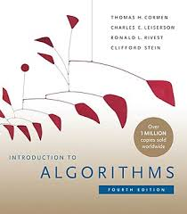

# Data Structures and Algorithms

Data Structures and Algorithms with their design, analysis, and applications in real-life scenarios.

## Introduction

To start off, I would like to iterate on coding a subset of programming. It is not emphasized enough that the topic of 
data structures and algorithms is integral to it. We should write good code, not just any type of code. And the studying
the latter helps in so.

!!majorly these repository is greatly influenced and a product of reading CLRS!!



## So what are they:
### Data structures
    These are ways to store data for easy access and modifications. 

### Algorithms
    an algorithm is any well defined computational procedure that takes
    some value, or set of values, as input and produces some value, or set of values, as
    output in a finite amount of time.

WOW! so some input, then the input goes through a well computational procedure and then 
some output but this must take place in a finite amount of time.

So key points is memory (for the data in the algorithm) and time.

## Considering a common LeetCode problem (Two Sum)

### Python
```python
    class Solution:
        def two_sum(nums, target):
            for i in range(len(nums)):
                for j in range(i):
                    if nums[i] + nums[j] == target:
                        return [i, j]
```
### C++
```c++
    class Solution {
    public:
        vector<int> twoSum(vector<int>& nums, int target) {
            for (int i = 0; i < nums.size(); ++i) {
                for (int j = 0; j < i; ++j) {
                    if (nums[i] + nums[j] == target) {
                        return {i, j}; 
                    }
                }
            }
            return {}; 
        }
    };
```

The above code achieves the same thing. Solving a classic problem in leetcode, no. 1
known as Two Sum. But I am not here to explain leetcode or the solution. I do research
on algorithms and data structures and their analysis. Wow the above codes run well but apply 
nested loops. The loops overall using a common analysis way of Big O notation are o(n^2) . 
Thats expensive on runtime(
    - Runtime affects user experience, applications that take longer to run are not preferred.
    [an issue with performance]
    -It also affects scalability, imagine running above code on large(humongous) datasets.
    -Unnecessary resource usage hence also high cost. Even in cloud setups, runtime is accounted for
     so one can pay unnecessary money for such.)
