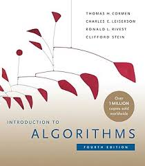

# Data Structures and Algorithms

Data Structures and Algorithms with their design, analysis, and applications in real-life scenarios.

## Introduction

To start off, I would like to iterate on coding a subset of programming. It is not emphasized enough that the topic of 
data structures and algorithms is integral to it. We should write good code, not just any type of code. And the latter
helps in so.

## So what are they:
   ## Data structures
      These are ways to store data for easy access and modifications. 
      <majorly these repository is greatly influenced and a product of reading CLRS>
      

